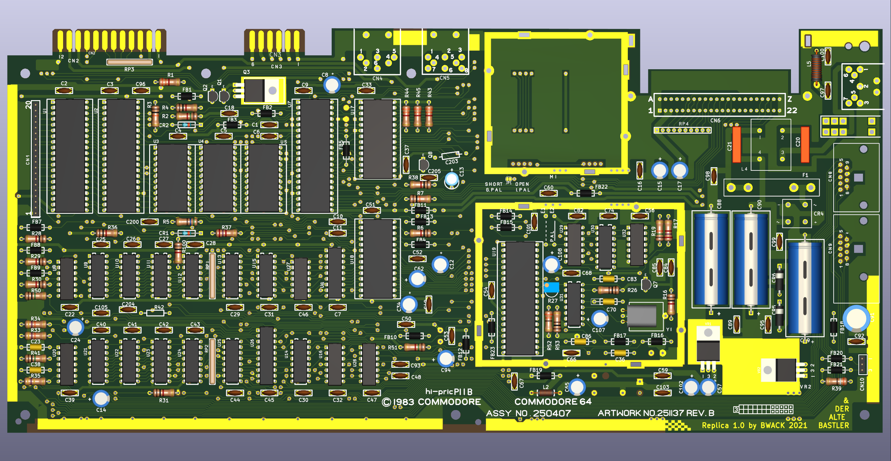
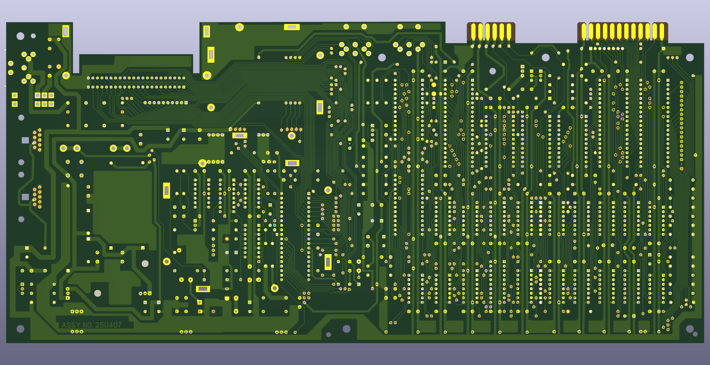

# The C64 250407 replica

Update: I'm waiting for components now and will solder up the board soon. I will release the kicad files after that.

# Interactive-BOM

[The interactive bom html page](https://htmlpreview.github.io/?https://raw.githubusercontent.com/bwack/C64-250407-Replica-KiCad/main/interactive-bom/ibom.html) is useful for assembling the board and finding signal traces by using a web browser. Try it here. For a BOM for ordering parts see the BOM above.

# Change log

# YouTube

