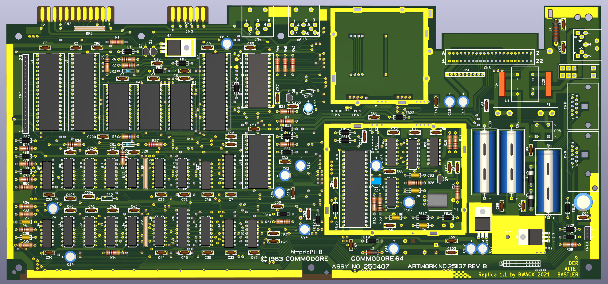
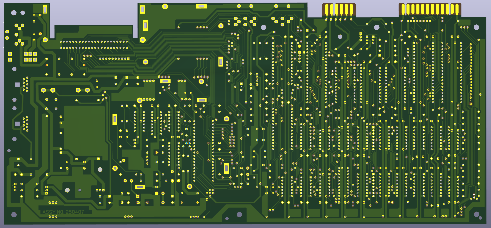
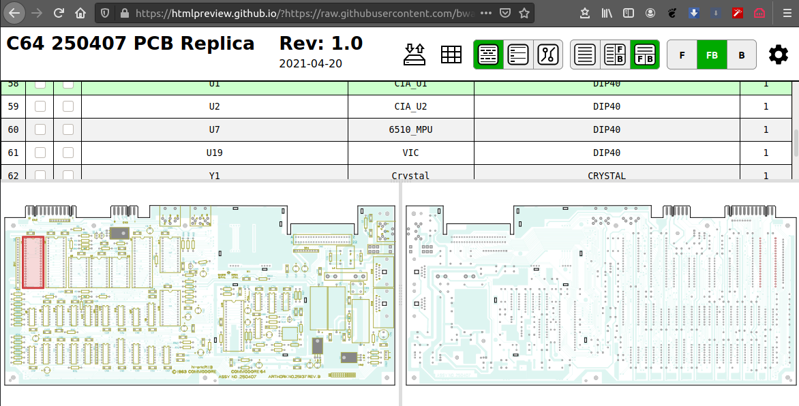

# The C64 250407 replica

A replica of the Commodore 64 250407 1983 mother board, and a replica of the schematics made using SprintLayout and KiCad.

The replica project was started by Michael K. (Der Alte Bastler) in 2019 to learn SprintLayout and the process of reverse engineering PCB. I finished it, importet it in KiCad, imported the KU motherboard schematics and modified it to match the 250407 Reb.B schematics.

The board has been prototyped, and tested by me and Langwell Cowan.

We are not the first to reverse engineer this board, but we are the first to share the design files online I think.

# BOM

Please see the [BOM file](250407_bom.csv).

# Interactive-BOM

[The interactive bom html page](https://htmlpreview.github.io/?https://raw.githubusercontent.com/bwack/C64-250407-Replica-KiCad/main/interactive-bom/ibom.html) is useful for assembling the board and finding signal traces by using a web browser. Try it here. For a BOM for ordering parts see the BOM above.

# Questions

* Feel free post questions in the issues section. I will provide more information here later.

# Change log
- 2020-06-19: V1.1: First release
- 2020-04-22: V1.0: Prototype

# YouTube

Part 1-4:

# License and Disclaimer

Copyright Bwack 2021

This documentation describes Open Hardware and is licensed under the CERN OHL v. 1.2.

You may redistribute and modify this documentation under the terms of theCERN OHL v.1.2. (http://ohwr.org/cernohl). This documentation is distributed WITHOUT ANY EXPRESS OR IMPLIED WARRANTY, INCLUDING OF MERCHANTABILITY, SATISFACTORY QUALITY AND FITNESS FOR APARTICULAR PURPOSE. Please see the CERN OHL v.1.2 for applicable conditions.
